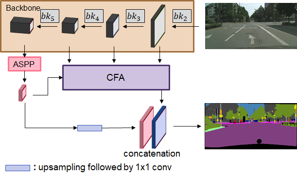

# SFNet: Sketch-and-Fill Network for Semantic Segmentation

## Introduction

This repository is a PyTorch implementation of [SFNet](https://hszhao.github.io/projects/psanet). This work is based on [semseg](https://github.com/hszhao/semseg/blob/1.0.0/README.md).



The codebase mainly uses ResNet50/101 and MobileNet-V2 as backbone and can be easily adapted to other basic classification structures. 

Sample experimented dataset is [Cityscapes](https://www.cityscapes-dataset.com), [ADE20K](https://groups.csail.mit.edu/vision/datasets/ADE20K/) and [RUGD](http://rugd.vision/).

## Requirement
Hardware: >= 44G GPU memory

Software: [PyTorch](https://pytorch.org/)>=1.0.0, python3

## Usage
For installation, follow installation steps below or recommend you to refer to the instructions described [here](https://github.com/hszhao/semseg/blob/1.0.0/README.md).

If you use multiple GPUs for training, [Apex](https://github.com/NVIDIA/apex) is required for synchronized training (such as Sync-BN).

For its pretrained model, you can download from [my drive](https://drive.google.com/file/d/1fxPpA_mkk1Ijur8HTnrkQtchVbYhzLyI/view?usp=sharing).

## Getting Started

### Installation

1. Clone this repository.
```
git clone https://github.com/youngsjjn/SFNet.git
```

2. Install Python dependencies.
```
pip install -r requirements.txt
```

### Implementation
1. Download datasets (i.e. [Cityscapes](https://www.cityscapes-dataset.com), [ADE20K](https://groups.csail.mit.edu/vision/datasets/ADE20K/) and [RUGD](http://rugd.vision/)) and change the root of data path in [config](./config/cityscapes/cityscapes_transform101.yaml).
Download data list and pre-trained backbone models (ResNet50/101) [here](https://drive.google.com/open?id=15wx9vOM0euyizq-M1uINgN0_wjVRf9J3).

2. Train (Evaluation is included at the end of the training)
```
sh tool/train.sh cityscapes sfnet101
```

3. Test
```
sh tool/test.sh cityscapes sfnet101
```

   |  Backbone | Dataset  |     mIoU     |
   | :-------: | :----------: | :----------: |
   | ResNet-101  | Cityscapes (val) |  81.7    |
   | :-------: | :----------: | :----------: |
   | ResNet-50  | ADE20K |  43.95   |
   | ResNet-101  | ADE20K |  45.18   |
   | :-------: | :----------: | :----------: |
   | ResNet-50  | RUGD (val/test) |  40.73 / 36.89   |
   
   
### Citation

You may want to cite:

```
@ARTICLE{9453770,
  author={Jin, Youngsaeng and Eum, Sungmin and Han, David and Ko, Hanseok},
  journal={IEEE Access}, 
  title={Sketch-and-Fill Network for Semantic Segmentation}, 
  year={2021},
  volume={9},
  number={},
  pages={85874-85884},
  doi={10.1109/ACCESS.2021.3088854}}
```
